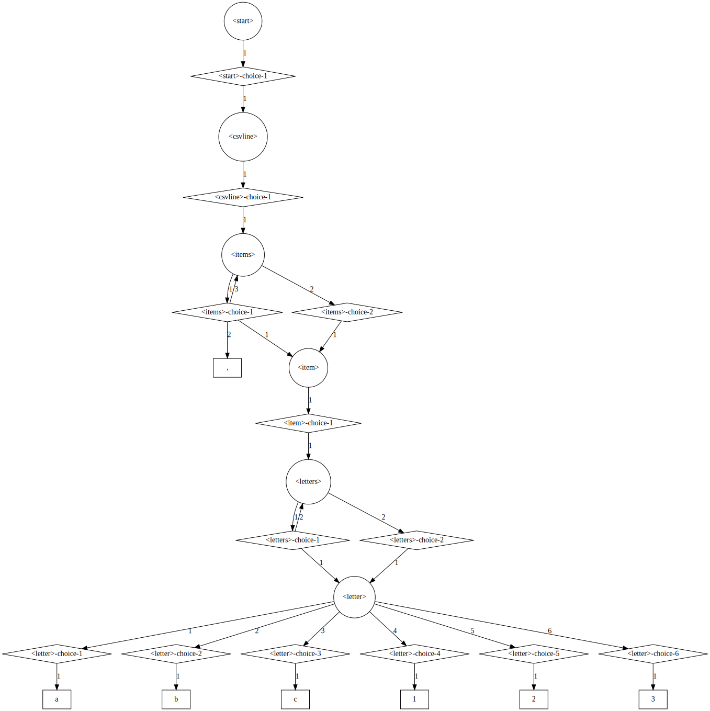

# GrammarGraph Feature Demo

GrammarGraph lets you build a directed graph from a context-free grammar (CFG).
A context-free grammar is a mapping from nonterminals to lists of expansion alternatives.
For instance, the following grammar represents a CSV file:


```python
import string
from typing import List, Dict

CSV_GRAMMAR: Dict[str, List[str]] = {
    '<start>': ['<csvline>'],
    '<csvline>': ['<items>'],
    '<items>': ['<item>,<items>', '<item>'],
    '<item>': ['<letters>'],
    '<letters>': ['<letter><letters>', '<letter>'],
    '<letter>': list(string.ascii_letters + string.digits + string.punctuation + ' \t\n')
}
```

This particular representation of a grammar is based on the [Fuzzing Book](https://www.fuzzingbook.org/).
Such a grammar can, e.g., be used to create random CSV files (based on Fuzzing Book implementations,
this is independent from GrammarGraph):


```python
from fuzzingbook.GrammarCoverageFuzzer import GrammarCoverageFuzzer

fuzzer = GrammarCoverageFuzzer(CSV_GRAMMAR)

for _ in range(10):
    print(fuzzer.fuzz())
```

    r,#k
    !Udi,z`C/,?t.
    @sYh,nW
    	cK
    +
    yT
    x
    N}X
    |<q',b,j%,^-="[Hw,S
    l,
    u,Q,7aO


## Visualization

Using GrammarGraph, we can visualize this grammar based on GraphViz. To make sure everything
fits on the screen, we reduce the number of alternatives for the `<letter>` nonterminal.

```python
CSV_GRAMMAR["<letter>"] = ['a', 'b', 'c', '1', '2', '3']

from grammar_graph import GrammarGraph

graph = GrammarGraph.from_grammar(CSV_GRAMMAR)
graph.to_dot()
```


    

    


## Sub Graphs

We can create and visualize sub graphs:


```python
graph.subgraph("<letters>").to_dot()
```


    

    


We can also check whether a subgraph is a tree structure (and can thus, e.g., be trivially
converted to a regular expression), or whether a node is reachable from another one:


```python
graph.subgraph("<letter>").is_tree()
```


    True


```python
graph.subgraph("<letters>").is_tree()
```


    False


```python
letters = graph.get_node("<letters>")
letters.reachable(letters)
```


    True


You can also create a sub grammar from a sub graph.


```python
graph.subgraph("<letters>").to_grammar()
```


    {'<start>': ['<letters>'],
     '<letters>': ['<letter><letters>', '<letter>'],
     '<letter>': ['a', 'b', 'c', '1', '2', '3']}


## Search, Filtering, Shortest Paths

GrammarGraph features implementations of breadth-first search, filtering, and shortest path
discovery (based on Dijkstra's algorithm with Fibonacci heaps). This can, e.g., be used to
embed a subtree into a bigger context. For instance, the shortest path from `<items>` to `<letter>` is:


```python
[node.symbol for node in graph.shortest_path(graph.get_node("<items>"), graph.get_node("<letter>"))]
```


    ['<items>', '<item>', '<letters>', '<letter>']


Let us assume we have CSV item `"abc"` from which we want to create a (random) CSV file. We can accomplish
this by finding the shortest path from `<start>` to `<item>` and follow this path, choosing an appropriate
grammar production rule along the way.


```python
from fuzzingbook.Grammars import unreachable_nonterminals, is_nonterminal
from fuzzingbook.Parser import EarleyParser
import copy

item_string = "abc"

# We massage the grammar a little bit to get a tree starting at `<item>`
item_grammar = copy.deepcopy(CSV_GRAMMAR)
item_grammar["<start>"] = ["<item>"]
for unreachable in unreachable_nonterminals(item_grammar):
    del item_grammar[unreachable]

item_tree = next(EarleyParser(item_grammar).parse(item_string))[1][0]
item_tree
```


    ('<item>',
     [('<letters>',
       [('<letter>', [('a', [])]),
        ('<letters>',
         [('<letter>', [('b', [])]),
          ('<letters>', [('<letter>', [('c', [])])])])])])


The path we need to follow for creating a complete file embedding `item` is:


```python
item_node = graph.get_node("<item>")

path = [node.symbol for node in graph.shortest_path(graph.root, item_node)]
path
```


    ['<start>', '<csvline>', '<items>', '<item>']


So let's create a derivation tree. In principle, such a tree will be incomplete, namely if an
expansion alternative contains nonterminals which we do not have to follow. Such incomplete
nodes have `None` as children and can later on be instantiated, e.g., by a fuzzer. For our simple
CSV grammar, however, this is not the case. In the algorithm sketched below we still account for this.

We use a "canonical" grammar representation for simplicity.


```python
from fuzzingbook.Parser import canonical

canonical_grammar = canonical(CSV_GRAMMAR)
canonical_grammar
```


    {'<start>': [['<csvline>']],
     '<csvline>': [['<items>']],
     '<items>': [['<item>', ',', '<items>'], ['<item>']],
     '<item>': [['<letters>']],
     '<letters>': [['<letter>', '<letters>'], ['<letter>']],
     '<letter>': [['a'], ['b'], ['c'], ['1'], ['2'], ['3']]}


```python
assert graph.root.reachable(item_node)


def wrap_in_tree_starting_in(start_nonterminal: str, tree, grammar, graph: GrammarGraph):
    start_node = graph.get_node(start_nonterminal)
    end_node = graph.get_node(tree[0])
    assert start_node.reachable(end_node)

    derivation_path = [n.symbol for n in graph.shortest_non_trivial_path(start_node, end_node)]

    result = (start_nonterminal, [])
    curr_tree = result
    for path_idx in range(len(derivation_path) - 1):
        path_nonterminal = derivation_path[path_idx]
        next_nonterminal = derivation_path[path_idx + 1]
        alternatives_for_path_nonterminal = [a for a in grammar[path_nonterminal]
                                             if next_nonterminal in a]
        shortest_alt_for_path_nonterminal = \
            [a for a in alternatives_for_path_nonterminal
             if not any(a_ for a_ in alternatives_for_path_nonterminal
                        if len(a_) < len(a))][0]
        idx_of_next_nonterminal = shortest_alt_for_path_nonterminal.index(next_nonterminal)
        for alt_idx, alt_symbol in enumerate(shortest_alt_for_path_nonterminal):
            if alt_idx == idx_of_next_nonterminal:
                if path_idx == len(derivation_path) - 2:
                    curr_tree[1].append(tree)
                else:
                    curr_tree[1].append((alt_symbol, []))
            else:
                curr_tree[1].append((alt_symbol, None if is_nonterminal(alt_symbol) else []))

        curr_tree = curr_tree[1][idx_of_next_nonterminal]

    return result


wrapped_tree = wrap_in_tree_starting_in("<start>", item_tree, canonical_grammar, graph)
wrapped_tree
```


    ('<start>',
     [('<csvline>',
       [('<items>',
         [('<item>',
           [('<letters>',
             [('<letter>', [('a', [])]),
              ('<letters>',
               [('<letter>', [('b', [])]),
                ('<letters>', [('<letter>', [('c', [])])])])])])])])])


```python
from fuzzingbook.GrammarFuzzer import tree_to_string

tree_to_string(wrapped_tree)
```


    'abc'


Now let's assume that we want to add another item into that tree. We can do so, e.g., by
replacing the top-level `<items>` node with another `<items>` node expanded once more.
The shortest node from `<items>` to `<items>`, however, is trivial:


```python
items = graph.get_node("<items>")
[node.symbol for node in graph.shortest_path(items, items)]
```


    ['<items>']


The function `get_shortest_non_trivial_path` returns a nontrivial path which is useful for
our purposes:


```python
[node.symbol for node in graph.shortest_non_trivial_path(items, items)]
```


    ['<items>', '<items>']


The astute reader may have discovered that this method is also used in the above
declaration of `wrap_in_tree_starting_in`, which is why we can use this routine
also for mapping a tree into one starting with the same nonterminal!


```python
items_tree = ('<items>',
              [('<item>',
                [('<letters>',
                  [('<letter>', [('a', [])]),
                   ('<letters>',
                    [('<letter>', [('b', [])]),
                     ('<letters>', [('<letter>', [('c', [])])])])])])])

wrapped_tree = wrap_in_tree_starting_in("<items>", items_tree, canonical_grammar, graph)
wrapped_tree
```


    ('<items>',
     [('<item>', None),
      (',', []),
      ('<items>',
       [('<item>',
         [('<letters>',
           [('<letter>', [('a', [])]),
            ('<letters>',
             [('<letter>', [('b', [])]),
              ('<letters>', [('<letter>', [('c', [])])])])])])])])


If we now embed this tree into a one starting in `<start>`, we have an incomplete derivation tree
with a "hole" for another item.


```python
wrapped_tree = wrap_in_tree_starting_in("<start>", wrapped_tree, canonical_grammar, graph)
wrapped_tree
```


    ('<start>',
     [('<csvline>',
       [('<items>',
         [('<item>', None),
          (',', []),
          ('<items>',
           [('<item>',
             [('<letters>',
               [('<letter>', [('a', [])]),
                ('<letters>',
                 [('<letter>', [('b', [])]),
                  ('<letters>', [('<letter>', [('c', [])])])])])])])])])])


```python
tree_to_string(wrapped_tree)
```


    ',abc'


Let's complete this tree using the fuzzer:


```python
complete_tree = fuzzer.expand_tree(wrapped_tree)
complete_tree
```


    ('<start>',
     [('<csvline>',
       [('<items>',
         [('<item>', [('<letters>', [('<letter>', [('1', [])])])]),
          (',', []),
          ('<items>',
           [('<item>',
             [('<letters>',
               [('<letter>', [('a', [])]),
                ('<letters>',
                 [('<letter>', [('b', [])]),
                  ('<letters>', [('<letter>', [('c', [])])])])])])])])])])


```python
tree_to_string(complete_tree)
```


    '1,abc'


## k-path Coverage

k-paths is a grammar coverage metric proposed by [Havrikov et al.](https://ieeexplore.ieee.org/document/8952419). The
idea is to extract all paths of length k from the grammar as well as from a derivation tree, and check how many grammar
paths are covered by the derivation tree.

We experiment with an arithmetic expressions grammar, which is the initial example from Havrikov et al.


```python
from fuzzingbook.Grammars import srange
```


```python
expr_grammar = {
    "<start>": ["<add_expr>"],
    "<add_expr>": ["<mult_expr>", "<add_expr> <add_symbol> <mult_expr>"],
    "<add_symbol>": ["+", "-"],
    "<mult_expr>": ["<unary_expr>", "<mult_expr> <mult_symbol> <unary_expr>"],
    "<mult_symbol>": ["*", "/", "%"],
    "<unary_expr>": ["<id>", "<unary_symbol><unary_expr>", "(<add_expr>)", "<dec_digits>"],
    "<unary_symbol>": ["+", "-", "++", "--"],
    "<dec_digits>": ["<dec_digit><maybe_dec_digits>"],
    "<maybe_dec_digits>": ["", "<dec_digits>"],
    "<dec_digit>": srange(string.digits),
    "<id>": ["x", "y", "z"]
}
```

First, we obtain the 2-paths from the grammar:


```python
graph = GrammarGraph.from_grammar(expr_grammar)
two_paths = graph.k_paths(2)

print("\n".join(map(str, [" ".join(map(str, [node.symbol for node in path])) for path in two_paths])))
```

    <start> <start>-choice-1 <add_expr>
    <add_expr> <add_expr>-choice-1 <mult_expr>
    <add_expr> <add_expr>-choice-2 <add_expr>
    <add_expr> <add_expr>-choice-2  
    <add_expr> <add_expr>-choice-2 <add_symbol>
    <add_expr> <add_expr>-choice-2  
    <add_expr> <add_expr>-choice-2 <mult_expr>
    <mult_expr> <mult_expr>-choice-1 <unary_expr>
    <mult_expr> <mult_expr>-choice-2 <mult_expr>
    <mult_expr> <mult_expr>-choice-2  
    <mult_expr> <mult_expr>-choice-2 <mult_symbol>
    <mult_expr> <mult_expr>-choice-2  
    <mult_expr> <mult_expr>-choice-2 <unary_expr>
    <add_symbol> <add_symbol>-choice-1 +
    <add_symbol> <add_symbol>-choice-2 -
    <unary_expr> <unary_expr>-choice-1 <id>
    <unary_expr> <unary_expr>-choice-2 <unary_symbol>
    <unary_expr> <unary_expr>-choice-2 <unary_expr>
    <unary_expr> <unary_expr>-choice-3 (
    <unary_expr> <unary_expr>-choice-3 <add_expr>
    <unary_expr> <unary_expr>-choice-3 )
    <unary_expr> <unary_expr>-choice-4 <dec_digits>
    <mult_symbol> <mult_symbol>-choice-1 *
    <mult_symbol> <mult_symbol>-choice-2 /
    <mult_symbol> <mult_symbol>-choice-3 %
    <id> <id>-choice-1 x
    <id> <id>-choice-2 y
    <id> <id>-choice-3 z
    <unary_symbol> <unary_symbol>-choice-1 +
    <unary_symbol> <unary_symbol>-choice-2 -
    <unary_symbol> <unary_symbol>-choice-3 ++
    <unary_symbol> <unary_symbol>-choice-4 --
    <dec_digits> <dec_digits>-choice-1 <dec_digit>
    <dec_digits> <dec_digits>-choice-1 <maybe_dec_digits>
    <dec_digit> <dec_digit>-choice-1 0
    <dec_digit> <dec_digit>-choice-2 1
    <dec_digit> <dec_digit>-choice-3 2
    <dec_digit> <dec_digit>-choice-4 3
    <dec_digit> <dec_digit>-choice-5 4
    <dec_digit> <dec_digit>-choice-6 5
    <dec_digit> <dec_digit>-choice-7 6
    <dec_digit> <dec_digit>-choice-8 7
    <dec_digit> <dec_digit>-choice-9 8
    <dec_digit> <dec_digit>-choice-10 9
    <maybe_dec_digits> <maybe_dec_digits>-choice-1 
    <maybe_dec_digits> <maybe_dec_digits>-choice-2 <dec_digits>


Next, we get all 2-paths from the derivation tree of `x + 42`:


```python
parser = EarleyParser(expr_grammar)
tree = list(parser.parse("x + 42"))[0]
tree_two_paths = graph.k_paths_in_tree(tree, 2)
```


```python
print("\n".join(map(str, [" ".join(map(str, [node.symbol for node in path])) for path in tree_two_paths])))
```

    <start> <start>-choice-1 <add_expr>
    <add_expr> <add_expr>-choice-2 <add_expr>
    <add_expr> <add_expr>-choice-1 <mult_expr>
    <add_expr> <add_expr>-choice-2  
    <add_expr> <add_expr>-choice-2 <add_symbol>
    <add_symbol> <add_symbol>-choice-1 +
    <add_expr> <add_expr>-choice-2  
    <add_expr> <add_expr>-choice-2 <mult_expr>
    <mult_expr> <mult_expr>-choice-1 <unary_expr>


This gives rise to the k-path coverate metric:


```python
coverage = len(tree_two_paths) / len(two_paths)
coverage
```


    0.1956521739130435


We can also call the method `k_path_coverage` directly:


```python
graph.k_path_coverage(tree, 2)
```


    0.1956521739130435


Our input's 3-path coverage is worse, while its 1-path coverage (simple coverage of nonterminals) is better:


```python
graph.k_path_coverage(tree, 3)
```


    0.11764705882352941


```python
graph.k_path_coverage(tree, 1)
```


    0.5454545454545454


Let us fuzz some inputs and check their, say, 3-path coverage:


```python
fuzzer = GrammarCoverageFuzzer(expr_grammar)
for _ in range(20):
    tree = fuzzer.expand_tree(("<start>", None))
    print(f"{(tree_to_string(tree) + ',').ljust(40)} coverage: {round(graph.k_path_coverage(tree, 3)*100, 2)} %")
```

    ++(y / z - x % y + y * 8 % x),           coverage: 58.82 %
    --++-++937415026373,                     coverage: 14.12 %
    6 / -z,                                  coverage: 15.29 %
    x / z / (x + z) * ((z % y)),             coverage: 42.35 %
    (++--z * y) / 032 + 82 % 4 + x + z / 0 % -z, coverage: 75.29 %
    -(x / +z + (x - z) + 7 * (x)),           coverage: 63.53 %
    --x % y / ((1 - --21)),                  coverage: 48.24 %
    3,                                       coverage: 1.18 %
    (9 % z * -31 / 394 + +861) % ++x,        coverage: 61.18 %
    x * y * x % 3 * (x + y + x + (x)),       coverage: 51.76 %
    x % --(z) - (z / y % z) / 3,             coverage: 54.12 %
    0,                                       coverage: 1.18 %
    --+99 * 1 % 0,                           coverage: 31.76 %
    z / z + 4 / ++(++y * 50 * ((x)) % -(y % y / y) * (x)), coverage: 70.59 %
    x + x - x * z * (y - x) - x,             coverage: 47.06 %
    ++x + 310,                               coverage: 21.18 %
    4 % (z % x % --z) / +++--((+(z - x) / 46)) * --1, coverage: 71.76 %
    (y + x + y - y / y - x % (x)),           coverage: 41.18 %
    z + z / y + y / z - z % ++y,             coverage: 35.29 %
    (y * 98) - 32,                           coverage: 36.47 %


We think that representing CFGs as graphs is useful for a number of purposes such as the one
we looked into just now. Hopefully it can help you too!
